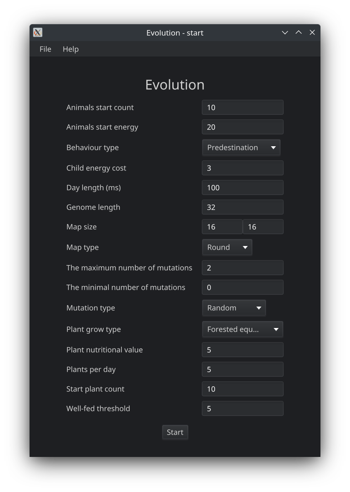
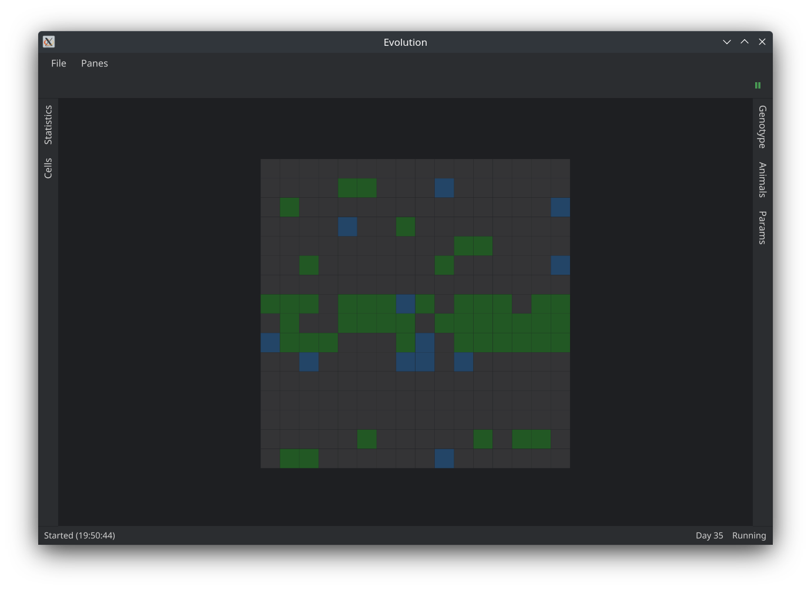
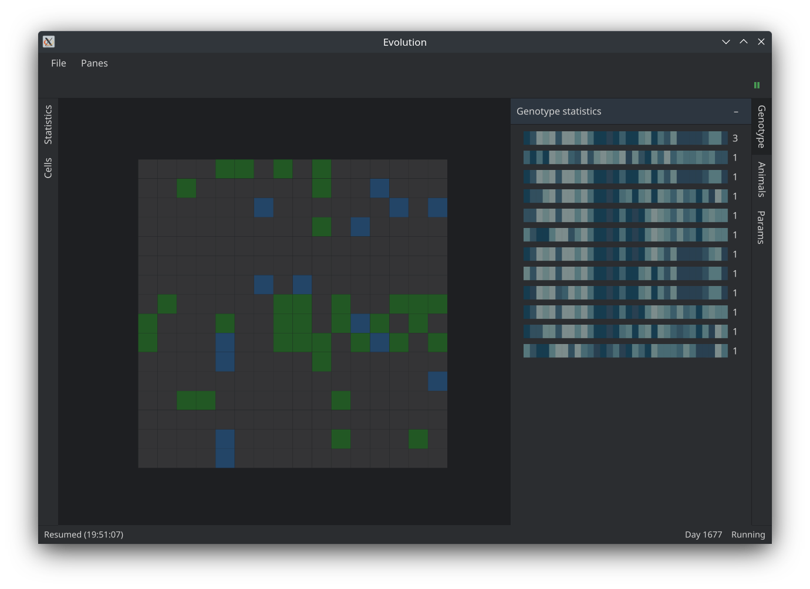
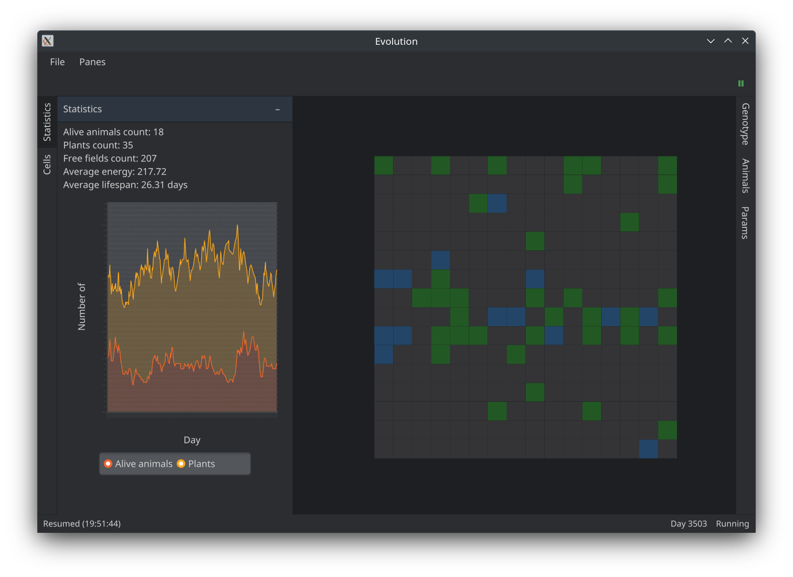
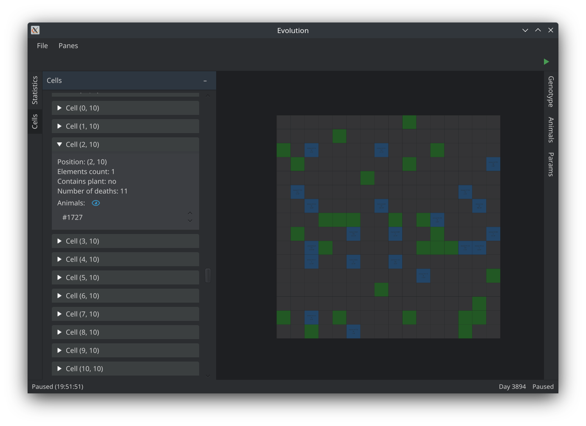
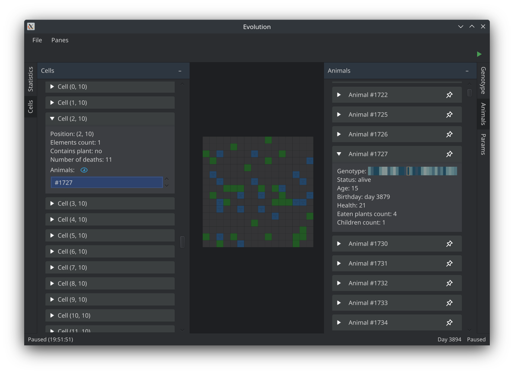
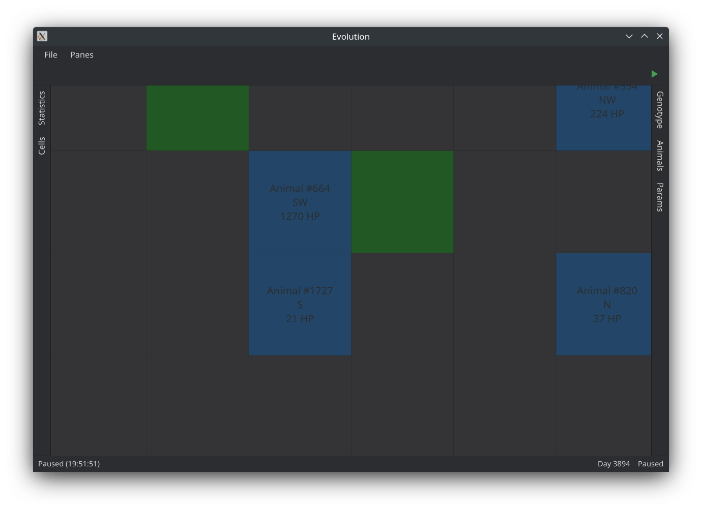

# Evolution

This project is developed by [congard](https://github.com/congard) within the subject
of Object Orientated Programming at the AGH University of Science and Technology.

Project description: [apohllo/obiektowe-lab/proj1](https://github.com/apohllo/obiektowe-lab/tree/f37bdcef7cdda5b7a933cf93f87ec78e28a018e5/proj1)

Technology: Java (simulation), Kotlin (JavaFX GUI)

Libraries used:

- [org.json](https://mvnrepository.com/artifact/org.json/json)
- [OpenCSV](https://mvnrepository.com/artifact/com.opencsv/opencsv)

## Hints

- Use the mouse wheel (or touchpad) to zoom in/out the map
- Right-click a cell to show its info (and the objects in it)
- You can resize border panes with mouse
- Some params can be changed during simulation
- Pin the animal you want to observe
- Cells pane: double-click an animal to see its info

## Screenshots

## Notes

- On Linux you may need to add `-Dprism.forceGPU=true` JVM option to improve GUI performance

## TODO

### simulation

- [x] Params
  - [x] Export to JSON
  - [x] Import from JSON
- [x] `Vector2d`
- [x] `WeightedRandom`
- [x] `Orientation`
- [x] `Gene`
- [x] `Genotype`
  - [x] `static Genotype mix(Genotype left, Genotype right, float pos)`
- [x] `WorldCell`
- [x] `AbstractWorld`
  - [x] Statistics to CSV
    - [x] `OpenCSV` : https://mvnrepository.com/artifact/com.opencsv/opencsv
  - [x] `synchronized void update()`
    - [x] Generate new grass
  - [x] `synchronized void forEachCell`
  - [x] `elements: List<List<List<WorldAbstractElement>>>`
  - [x] `deadAnimals: LinkedList<Animal>`
  - [x] `aliveAnimals: HashSet<Animal>`
  - [x] `synchronized void forEachAlive`
  - [x] `synchronized void forEachDead`
  - [x] `calcAvgLifespan()` - for dead
  - [x] `aliveAnimalsCount`
  - [x] `plantsCount`
  - [x] `freeFieldsCount`
  - [x] `avgEnergy` - for alive
  - [x] `day` - day number
  - [x] `long nextId()`
  - [x] `void add(WorldAbstractElement)`
  - [x] `void remove(WorldAbstractElement)`
- [x] `RoundWorld`
- [x] `PortalWorld`
- [x] `WorldElementType`
- [x] `WorldAbstractElement`
  - [x] `pos: Vector2d`
  - [x] `world: AbstractWorld`
  - [x] `type: WorldElementType`
  - [x] `void remove()`
- [x] `Plant`
  - [x] `nutritionalValue: Float`
- [x] `Animal`
  - [x] `eat(Plant)`
  - [x] `isWellFed()`
  - [x] `live()` - must be called by `SimulationEngine` every 'day'
  - [x] `orientation: Orientation`
  - [x] `children: LinkedList<Animal>`
  - [x] `parents: Animal[2]`
  - [x] `health: Float`
  - [x] `birthday: Int` - day number
  - [x] `deathday: Int` - `-1` if alive
  - [x] `eatenPlantsCount: Int`
  - [x] `genotype: Genotype`
  - [x] `id: long`
  - [x] `boolean isAlive()`
  - [x] `static Animal reproduce(Animal p1, Animal p2)`
- [x] `OnTickListener` : one tick - one day
- [x] `ErrorHandler`
- [x] `SimulationEngine`
  - [x] `void start()`
  - [x] `void pause()`
  - [x] `void stop()`
  - [x] `AbstractWorld getWorld()`
- [x] `Thread safety`
  - [x] Lists read/write

### gui

- [x] `StartScreen`
  - [x] use reflection for params
  - [x] import params from `json` file
  - [x] export params to `json` file
  - [x] enable Scroll for fields
- [x] `EvolutionWindow`
  - [x] Record button - record statistics to CSV
  - [x] `StatusBar`
  - [x] Update gui on `onTick`
- [x] `WorldWidget`
- [x] borders
  - [x] `StatsBorderPane`
  - [x] `ParamsBorderPane`
  - [x] `GenotypeStatsBorderPane`
    - [x] `GenotypePane`
  - [x] `CellsBorderPane`
  - [x] `AnimalsBorderPane`
- [ ] CSS styles for `Alert`
- [x] Tests for math

**Disclaimer**: I ran out of time, so you might find the code a bit undocumented
